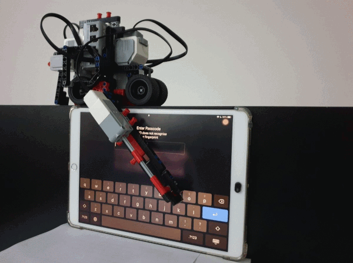

# EV3DisplayControl
EV3DispalyControl allows you to perform actions on a touch screen.

# Goal
Originally built for remote control of an Automotive test rack with an HMI touch screen.
In order to speed up tests and development, it was possible to control the HMI without physical access to it.
Commands for touch control can be queued, allowing automation of sequenced actions.

# Setup Guide
The project is provided with an Eclipse CDT project with Linux toolchain.

Dependencies:
- wxWidgets (successfully built with v3.0)
- OpenCV (successfully built with v3.2.0)
- ev3sources (submodule included in the repo)

# Building
Make sure `wx-config --cxxflags` is added to the compiling command, in the right order. I run into compiling problems for having it misplaced. If you use the provided Eclipse project, it should be fine.

# Running
Find out the device address of your EV3 USB connection, which is usually listed under /dev/hidraw<ID>.
Add the device path to config.ini file, e.g. robot_path=/dev/hidraw2.

In order to have read/write access to the EV3, you'll need to run EV3DisplayControl with root permissions.

# Tested under
OS: Ubuntu 18.04
IDE: Eclipse 4.13(2019-09 R)
wxWidgets: v3.0
OpenCv: v3.2.0
